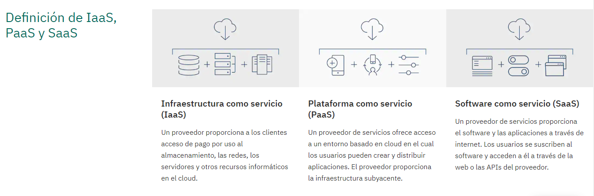

# Guión de la nube

### Objetivo

Mediante esta clase se pretende dotar de unos conocimientos basicos sobre como funcionas las diferentes nubes de internet y cuales existen a día de hoy. Además se pretende hacer ver que utilidad pueden llegar a tener en diferentes ambitos laborales. Para ello, el profesor se podrá basar en ejemplos y videos que se mostrarán a continuación:

| Contenido | Duración |
| ----- | ----- |
| **Clase** | **1 hora** |
| Introducción: | 20-30 minutos |
|	Procesadores | 15 minutos |
|	Ley de Moore | 10-15 minutos |
| Relación entre los dos conceptos previos | 15 -25 minutos |
| **Práctica procesador c5i** | **30 minutos** |

***

## intro 

/www.genbeta.com/desarrollo/entendiendo-la-nube-el-significado-de-saas-paas-y-iaas

https://www.ibm.com/es-es/cloud/learn/iaas-paas-saas

### Saas

providers: https://www.datamation.com/cloud-computing/50-leading-saas-companies.html

### Paas

https://www.devteam.space/blog/10-top-paas-providers-for-2019/

### Iaas

https://stackify.com/top-iaas-providers/

