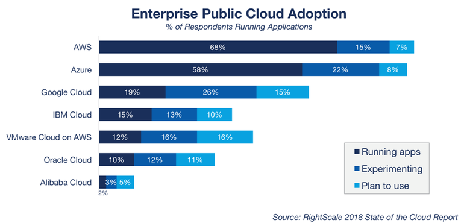
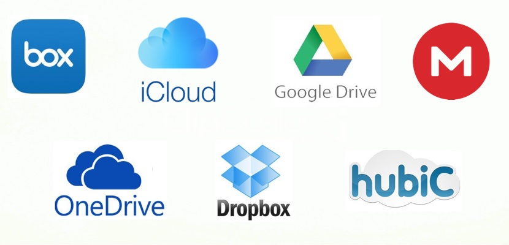

# Guión de la nube

### Objetivo

Mediante esta clase se pretende dotar de unos conocimientos básicos sobre como funcionas las diferentes nubes de internet y cuales existen a día de hoy. El alumno adquirirá conocimientos para distinguir entre las nubes *Iaas, Saas y Paas* y comprenderá cuándo y para qué emplear cada una. Además se pretende hacer ver que utilidad pueden llegar a tener en diferentes ámbitos laborales. Para ello, el profesor se podrá basar en ejemplos y videos que se mostrarán a continuación:

| Contenido | Duración |
| ----- | ----- |
| **Clase** | **45 hora** |
| Introducción: | 10 minutos |
|	Saas | 5 minutos |
|	Paas | 10-15 minutos |
| Iaas | 15 -25 minutos |
| **Práctica procesador c5i** | **30 minutos** |

***

## introducción

**Definición y explicación de qué es la nube**

1. [Link 1](http://diccionario.raing.es/es/lema/computaci%C3%B3n-en-la-nube)
2. [Link 2]()
3. [link 3](https://es.wikipedia.org/wiki/Computaci%C3%B3n_en_la_nube)

**Características:**

+ *Agilidad*
+ *Escalabilidad y elasticidad*
+ *Independencia entre el dispositivo y la ubicación*
+ *Permite compartir servidores y dispositivos de almacenamiento*
+ *Rendimiento*
+ *Seguridad*
+ *Mantenimiento*

[source](https://es.wikipedia.org/wiki/Computaci%C3%B3n_en_la_nube)

| **Ventajas** | **Desventajas** |
| ----- | ----- |
|  Integración probada de servicios Red |  Centralización de datos  |
| Prestación de servicios a nivel mundial | La confiabilidad de los servicios depende de la "salud" tecnológica |
|	Permite prescindir de instalar cualquier tipo de software  | La disponibilidad de servicios altamente especializadosmuy limitada |
|	Implementación más rápida y con menos riesgos | Curva de aprendizaje en empresas de orientación no tecnológica tenga unas pendientes significativas |
| compartir servidores y dispositivos de almacenamiento | Seguridad de la información de la empresa  |
| Actualizaciones automáticas que no afectan negativamente a los recursos de TI | Escalabilidad a largo plazo |
| Contribuye al uso eficiente de la energía: |  |

[source](https://es.wikipedia.org/wiki/Computaci%C3%B3n_en_la_nube)

> Cloud computing es un nuevo modelo de prestación de servicios de negocio y tecnología, que permite incluso al usuario acceder a un catálogo de servicios estandarizados y responder con ellos a las necesidades de su negocio, de forma flexible y adaptativa, en caso de demandas no previsibles o de picos de trabajo, pagando únicamente por el consumo efectuado, o incluso gratuitamente en caso de proveedores que se financian mediante publicidad o de organizaciones sin ánimo de lucro.

>El cambio que ofrece la computación desde la nube es que permite aumentar el número de servicios basados en la red. Esto genera beneficios tanto para los proveedores, que pueden ofrecer, de forma más rápida y eficiente, un mayor número de servicios, como para los usuarios que tienen la posibilidad de acceder a ellos, disfrutando de la ‘transparencia’ e inmediatez del sistema y de un modelo de pago por consumo. Así mismo, el consumidor ahorra los costes salariales o los costes en inversión económica (locales, material especializado, etc.).

[source](https://es.wikipedia.org/wiki/Computaci%C3%B3n_en_la_nube)

## Uso actual

+ [link](https://www.zdnet.com/article/top-cloud-providers-2018-how-aws-microsoft-google-ibm-oracle-alibaba-stack-up/): explicación de la situación actual del mercado en cuanto al uso de las diferentes nubes, los diferentes usos y el futuro que se espera.

**Video:** 

## Almacenamietno en la nube

+ [Link](https://es.wikipedia.org/wiki/Almacenamiento_en_nube): Explicación de qué es el almacenamiento en la nube.

**Video:** 

**Principales proveedores de almacenamiento en la nube:** 
+ [link](https://www.paredro.com/10sitios-almacenamiento-en-la-nube-guarda-respalda-tus-archivos/): principales proveedores de almacenamietno en la nube.

## La nube es mucho más que almacenamiento 

>El concepto de “nube informática” es muy amplio, y abarca casi todos los posibles tipo de servicio en línea, pero cuando las empresas predican ofrecer un utilitario alojado en la nube, por lo general se refieren a alguna de estas tres modalidades: el software como servicio (por sus siglas en inglés SaaS —Software as a Service—), Plataforma como Servicio (PaaS) e Infraestructura como Servicio (IaaS).

>El software como servicio (SaaS) es un modelo de distribución de software en el que las aplicaciones están alojadas por una compañía o proveedor de servicio y puestas a disposición de los usuarios a través de una red, generalmente la Internet. Plataforma como servicio (PaaS) es un conjunto de utilitarios para abastecer al usuario de sistemas operativos y servicios asociados a través de Internet sin necesidad de descargas o instalación alguna. Infraestructura como Servicio (IaaS) se refiere a la tercerización de los equipos utilizados para apoyar las operaciones, incluido el almacenamiento, hardware, servidores y componentes de red.
[source](https://es.wikipedia.org/wiki/Computaci%C3%B3n_en_la_nube)

**Diferenciar cada modalidad:**

+ [Link 1](https://www.genbeta.com/desarrollo/entendiendo-la-nube-el-significado-de-saas-paas-y-iaas)

+ [link 2](https://www.ibm.com/es-es/cloud/learn/iaas-paas-saas)

### Saas

providers: https://www.datamation.com/cloud-computing/50-leading-saas-companies.html

### Paas

https://www.devteam.space/blog/10-top-paas-providers-for-2019/

### Iaas

https://stackify.com/top-iaas-providers/

### videos

https://www.youtube.com/watch?v=36zducUX16w

https://www.youtube.com/watch?v=TIIVmM9RlCU
